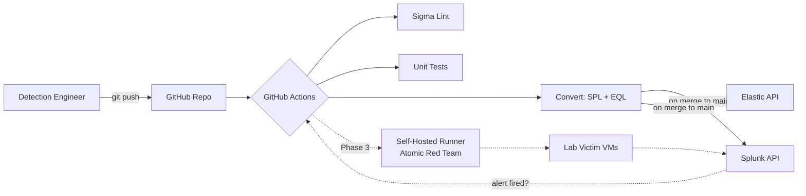

# Detection-as-Code Pipeline

[](https://github.com/sammyHa/detection-as-code/actions/workflows/validate.yml)
[](https://sigmahq.io/)
[](https://attack.mitre.org/)
[](LICENSE)

A production-style detection engineering pipeline. Sigma rules live in source control, every change runs through CI validation, and detections are auto-converted to Splunk SPL and Elastic EQL on merge. Tested against a live home SOC lab using Atomic Red Team detonations.

## Why this exists

Most detection content lives in vendor consoles where it can't be reviewed, versioned, or tested. This repo treats detections the way mature security teams treat them — as **code**: linted, unit tested, peer reviewed, and deployed via pipeline.

Built and maintained by [Samim Hakimi](https://www.linkedin.com/in/) as part of an enterprise-grade home SOC lab (40-core Dell R740xd, Arista 10GbE backbone, Splunk + ELK + Wazuh + Velociraptor).

## Architecture



## What's in here

| Path | Purpose |
|------|---------|
| `detections/` | Sigma rules organized by platform and ATT&CK tactic |
| `tests/atomics/` | Detection ↔ Atomic Red Team test mapping |
| `tests/unit/` | Pytest suites for Sigma syntax and structure |
| `tools/` | Validation, conversion, and deployment scripts |
| `.github/workflows/` | CI/CD definitions |
| `docs/` | Detection engineering process and contribution guides |

## Detection coverage

ATT&CK Navigator coverage layer is regenerated on every merge to `main` and committed to [`docs/coverage/coverage_layer.json`](docs/coverage/coverage_layer.json). Open it in [ATT&CK Navigator](https://mitre-attack.github.io/attack-navigator/) to view the live heatmap.

## Quick start

```bash
git clone https://github.com/sammyHa/detection-as-code.git
cd detection-as-code
python -m venv .venv && source .venv/bin/activate
pip install -e ".[dev]"

# Validate every Sigma rule locally
python tools/validate_sigma.py detections/

# Convert a single rule to Splunk SPL
python tools/sigma_to_splunk.py detections/windows/credential_access/T1003.001_lsass_dump_procdump.yml
```

## Adding a detection

See [`docs/adding_a_new_detection.md`](docs/adding_a_new_detection.md). The short version:

1. Create a new Sigma YAML under the appropriate `detections/<platform>/<tactic>/` directory.
2. Add or reference the matching Atomic Red Team test in `tests/atomics/`.
3. Open a PR. CI will validate syntax, run unit tests, and (Phase 3+) detonate the atomic in the lab and assert the alert fires.

## Roadmap

- [x] **Phase 1 — Foundation:** Repo structure, Sigma validation in CI, first detection
- [ ] **Phase 2 — Conversion & deploy:** pySigma → Splunk + Elastic, auto-deploy on merge
- [ ] **Phase 3 — Live testing:** Self-hosted runner, Atomic Red Team detonation, alert assertion
- [ ] **Phase 4 — Coverage reporting:** Auto-generated ATT&CK Navigator layer, coverage badge in README
- [ ] **Phase 5 — Hardening:** Backtesting framework, false-positive tracking, detection retirement workflow

## References

- [SigmaHQ](https://sigmahq.io/) — community detection format
- [pySigma](https://github.com/SigmaHQ/pySigma) — modern Sigma processing library
- [Atomic Red Team](https://github.com/redcanaryco/atomic-red-team) — adversary emulation library
- [Detection Engineering Maturity Matrix](https://detectionengineering.io/) — reference for the practice

## License

MIT
