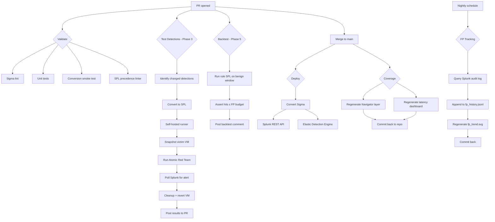

# Detection-as-Code Pipeline

[](https://github.com/sammyHa/detection-as-code/actions/workflows/validate.yml)
[](https://github.com/sammyHa/detection-as-code/actions/workflows/deploy.yml)
[](https://github.com/sammyHa/detection-as-code/actions/workflows/test-detections.yml)
[](https://github.com/sammyHa/detection-as-code/actions/workflows/backtest.yml)
[](docs/coverage/REPORT.md)
[](https://sigmahq.io/)
[](https://attack.mitre.org/)
[](LICENSE)

A production-style detection engineering pipeline. Sigma rules live in source control, every PR is validated AND continuously tested by detonating the corresponding Atomic Red Team test on a real Windows victim VM AND backtested against a benign telemetry corpus. Merges to `main` deploy to Splunk Enterprise and Elastic Security via REST APIs, executed by a self-hosted GitHub Actions runner inside a private SOC lab.

## What makes this different

> A PR cannot ship a detection that **doesn't catch the technique it claims to catch** OR **fires on benign telemetry above its FP budget**.

When a PR adds or modifies a Sigma rule, CI:
1. Snapshots a dedicated Windows victim VM via the Proxmox API
2. Detonates the matching Atomic Red Team test on the victim via WinRM
3. Polls Splunk via ad-hoc search until the detection fires (must fire within SLA)
4. Runs the same converted SPL against a 30-day benign window (must NOT fire above budget)
5. Reverts the VM to a clean snapshot
6. Posts pass/fail comments on the PR with detection latency, event count, and FP backtest results

Built and maintained by [Samim Hakimi](https://www.linkedin.com/in/) on an enterprise-grade home SOC lab (40-core Dell R740xd, Arista 10GbE backbone, Splunk + ELK + Wazuh + Velociraptor).

## Coverage

[](docs/coverage/REPORT.md) · See [`docs/coverage/REPORT.md`](docs/coverage/REPORT.md) for the full breakdown including retired rules · Open [`docs/coverage/coverage_layer.json`](docs/coverage/coverage_layer.json) in the [ATT&CK Navigator](https://mitre-attack.github.io/attack-navigator/) for the heatmap.

## Detection latency

Aggregated from the last ~30 days of Phase 3 detonation runs. Updated nightly.


## False-positive trend

Aggregated from nightly Splunk audit-log readings. Updated nightly. Climbing trends are early warnings; persistent above-budget rules are candidates for [retirement](docs/retirement_workflow.md).


## Architecture



## Repo structure

| Path | Purpose |
|------|---------|
| `detections/` | Active Sigma rules organized by platform and ATT&CK tactic |
| `detections/retired/` | Retired rules — preserved for audit, NOT deployed |
| `tests/atomics/` | Detection ↔ Atomic Red Team test mapping |
| `tests/unit/` | Pytest suites for Sigma, orchestrator, and pipeline tools |
| `tools/sigma_convert.py` | Sigma → SPL + EQL conversion |
| `tools/spl_lint.py` | Catches Splunk operator-precedence bugs |
| `tools/deploy_splunk.py` | Idempotent Splunk REST API deploy |
| `tools/deploy_elastic.py` | Idempotent Elastic Detection Engine deploy |
| `tools/coverage_report.py` | Generates Navigator layer + REPORT.md + badge JSON |
| `tools/latency_dashboard.py` | Generates SVG latency dashboard from Phase 3 reports |
| `tools/backtest.py` | Runs each rule against a benign Splunk window |
| `tools/fp_collector.py` | Nightly FP fire-count collection from Splunk audit log |
| `tools/fp_trend.py` | Generates SVG FP trend chart from history JSONL |
| `tools/retire_detection.py` | CLI to retire a rule with documented reason |
| `tools/orchestrator/` | Phase 3 detonation orchestrator |
| `.github/workflows/validate.yml` | PR validation pipeline |
| `.github/workflows/deploy.yml` | Merge-to-main deployment pipeline |
| `.github/workflows/test-detections.yml` | PR-triggered detonation pipeline |
| `.github/workflows/backtest.yml` | PR-triggered backtest pipeline |
| `.github/workflows/coverage.yml` | Coverage artifact regeneration |
| `.github/workflows/fp-tracking.yml` | Nightly FP rate collection |
| `docs/coverage/` | Auto-generated coverage artifacts (heatmap, report, badge, latency, fp_trend) |
| `docs/self_hosted_runner.md` | Lab runner integration setup |
| `docs/victim_vm_setup.md` | Windows victim VM build runbook |
| `docs/phase_3_design.md` | Detonation pipeline design rationale |
| `docs/benign_corpus_setup.md` | Backtest benign-window configuration |
| `docs/retirement_workflow.md` | When and how to retire a detection |
| `docs/known_issues.md` | Conversion gotchas and how the pipeline handles them |

## Quick start (local validation)

```bash
git clone https://github.com/sammyHa/detection-as-code.git
cd detection-as-code
python -m venv .venv && source .venv/bin/activate
pip install -e ".[dev]"

# Validate every Sigma rule locally
python tools/validate_sigma.py detections/

# Run the unit test suite
pytest tests/unit/ -v

# Convert all rules to Splunk SPL + Elastic EQL
python tools/sigma_convert.py --source detections/ --output build/

# Regenerate coverage artifacts
python tools/coverage_report.py --source detections/ --output docs/coverage/

# Retire a noisy rule (creates branch, you push and PR)
python tools/retire_detection.py <rule_uuid> --reason "your reason here"
```

## Adding a detection

See [`docs/adding_a_new_detection.md`](docs/adding_a_new_detection.md). Short version: write Sigma → add an atomic mapping → open PR → CI detonates the atomic and asserts the detection fires AND backtests against benign data → merge → pipeline deploys to lab Splunk and Elastic.

## Roadmap

- [x] **Phase 1 — Foundation:** Repo structure, Sigma validation in CI, first detections
- [x] **Phase 2 — Conversion & deploy:** pySigma → Splunk + Elastic, auto-deploy on merge, SPL precedence linter
- [x] **Phase 3 — Live testing:** Self-hosted runner detonates Atomic Red Team via WinRM, queries SIEM, asserts alerts fire, reverts victim VM via Proxmox API
- [x] **Phase 4 — Coverage reporting:** ATT&CK Navigator coverage layer, latency dashboard, badge, machine-generated coverage report
- [x] **Phase 5 — Hardening:** Backtesting against benign telemetry corpus, FP rate tracking with nightly history, retirement workflow with audit trail

## Engineering decisions worth calling out

- **Sigma is the source of truth.** SPL and EQL are build artifacts, never hand-edited.
- **Self-hosted runner over tunneled exposure.** Lab APIs are never exposed to the internet.
- **Per-test snapshot/revert via Proxmox API.** Every detonation gets a clean victim. No state pollution.
- **Ad-hoc Splunk search for assertion.** Bypasses the 5-minute scheduler so we measure true detection latency.
- **Backtesting is mandatory.** A rule that fires once on benign data is a future false positive. The PR fails until the rule is tuned or its FP budget is justified.
- **Append-only FP history.** `fp_history.jsonl` is never rewritten. Git history IS the audit trail.
- **Retirement is a workflow, not a delete.** Retired rules stay in the repo with documented reasoning. Future incident investigations can `git log` the deprecation.
- **All visualizations are SVG.** Render inline in GitHub markdown without JS or external services.

## License

MIT
