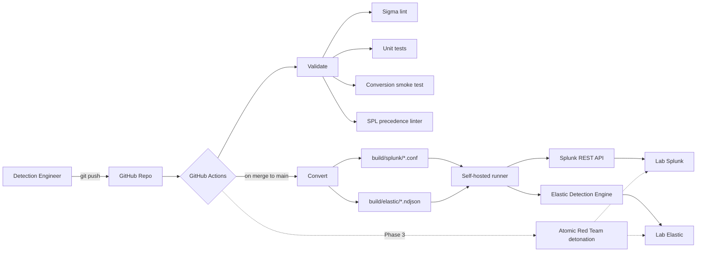

# Detection-as-Code Pipeline

[](https://github.com/sammyHa/detection-as-code/actions/workflows/validate.yml)
[](https://github.com/sammyHa/detection-as-code/actions/workflows/deploy.yml)
[](https://sigmahq.io/)
[](https://attack.mitre.org/)
[](LICENSE)

A production-style detection engineering pipeline. Sigma rules live in source control, every change runs through CI validation and conversion smoke tests, and merges to `main` trigger automated deployment to Splunk Enterprise and Elastic Security via REST APIs — executed by a self-hosted GitHub Actions runner inside a private SOC lab.

## Why this exists

Most detection content lives in vendor consoles where it can't be reviewed, versioned, or tested. This repo treats detections the way mature security teams treat them — as **code**: linted, unit tested, peer reviewed, converted, and deployed via pipeline.

Built and maintained by [Samim Hakimi](https://www.linkedin.com/in/) as part of an enterprise-grade home SOC lab (40-core Dell R740xd, Arista 10GbE backbone, Splunk + ELK + Wazuh + Velociraptor).

## Architecture



## What's in here

| Path | Purpose |
|------|---------|
| `detections/` | Sigma rules organized by platform and ATT&CK tactic |
| `tests/atomics/` | Detection ↔ Atomic Red Team test mapping |
| `tests/unit/` | Pytest suites for Sigma syntax and structure |
| `tools/sigma_convert.py` | Sigma → SPL + EQL conversion |
| `tools/spl_lint.py` | Catches Splunk operator-precedence bugs in converted output |
| `tools/deploy_splunk.py` | Idempotent Splunk REST API deploy |
| `tools/deploy_elastic.py` | Idempotent Elastic Detection Engine deploy |
| `.github/workflows/validate.yml` | PR validation pipeline |
| `.github/workflows/deploy.yml` | Merge-to-main deployment pipeline |
| `docs/self_hosted_runner.md` | Lab runner integration setup |
| `docs/known_issues.md` | Conversion gotchas and how the pipeline handles them |

## Detection coverage

ATT&CK Navigator coverage layer is regenerated on every merge to `main` (Phase 4). Until then, the [`detections/`](detections/) tree organization itself shows current coverage by tactic.

## Quick start

```bash
git clone https://github.com/sammyHa/detection-as-code.git
cd detection-as-code
python -m venv .venv && source .venv/bin/activate
pip install -e ".[dev]"

# Validate every Sigma rule locally
python tools/validate_sigma.py detections/

# Convert all rules to Splunk SPL + Elastic EQL
python tools/sigma_convert.py --source detections/ --output build/

# Catch SPL operator-precedence issues
python tools/spl_lint.py build/splunk/

# Deploy to lab Splunk (dry run, no creds needed)
python tools/deploy_splunk.py --build-dir build/splunk --dry-run

# Real deploy
SPLUNK_HOST=splunk.deltacode.local SPLUNK_TOKEN=... \
  python tools/deploy_splunk.py --build-dir build/splunk
```

## Adding a detection

See [`docs/adding_a_new_detection.md`](docs/adding_a_new_detection.md). Short version: write Sigma → open PR → CI validates and conversion-tests → merge → pipeline deploys to lab Splunk and Elastic.

## Roadmap

- [x] **Phase 1 — Foundation:** Repo structure, Sigma validation in CI, first detection
- [x] **Phase 2 — Conversion & deploy:** pySigma → Splunk + Elastic, auto-deploy on merge, SPL precedence linter
- [ ] **Phase 3 — Live testing:** Self-hosted runner detonates Atomic Red Team, queries SIEM, asserts alerts fire
- [ ] **Phase 4 — Coverage reporting:** Auto-generated ATT&CK Navigator layer, coverage badge
- [ ] **Phase 5 — Hardening:** Backtesting framework, false-positive tracking, detection retirement workflow

## Engineering decisions worth calling out

- **Sigma is the source of truth.** SPL and EQL are build artifacts, never hand-edited.
- **Self-hosted runner over tunneled exposure.** Lab APIs are never exposed to the internet. The runner only makes outbound long-poll connections to GitHub.
- **Conversion is separated from deployment.** `sigma_convert.py` is a pure function — same input always produces the same output. Build artifacts are committed and reviewable in PRs (Phase 4 enhancement).
- **Idempotent deployment.** Re-running `deploy_splunk.py` or `deploy_elastic.py` is always safe. Existing rules update; new rules create.
- **Honest about tooling limitations.** [`docs/known_issues.md`](docs/known_issues.md) documents real conversion gotchas like the unparenthesized-OR issue. Detection engineering at scale means trusting your tools while verifying them.

## References

- [SigmaHQ](https://sigmahq.io/) — community detection format
- [pySigma](https://github.com/SigmaHQ/pySigma) — modern Sigma processing library
- [Atomic Red Team](https://github.com/redcanaryco/atomic-red-team) — adversary emulation library
- [Detection Engineering Maturity Matrix](https://detectionengineering.io/) — reference for the practice
- [Splunk REST API: saved searches](https://docs.splunk.com/Documentation/Splunk/latest/RESTREF/RESTsearch#saved.2Fsearches)
- [Elastic Detection Engine API](https://www.elastic.co/guide/en/security/current/rule-api-overview.html)

## License

MIT
